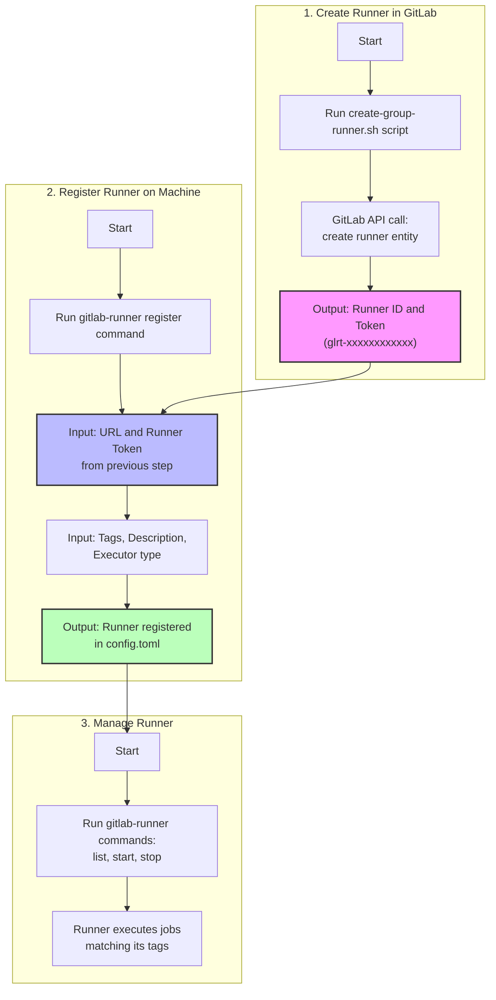

# GitLab Runner: Creation vs Registration

Setting up a GitLab Runner is a two-phase process. This document explains the difference between creating a runner entity in GitLab and registering an actual runner on a machine.

## Process Overview

The diagram below illustrates the complete workflow:



## Phase 1: Creating a Runner Entity in GitLab

This phase creates a placeholder in GitLab that represents a runner.

**Inputs:**
- Group ID
- Runner description
- Tag list
- Run untagged setting (true/false)
- Locked setting (true/false)

**Process:**
```bash
# Using our script
./scripts/gitlab/create-group-runner.sh -g "siphon-ecosystem"

# Or using GitLab UI
# Go to Group → Settings → CI/CD → Runners → "New runner"
```

**Outputs:**
- Runner ID in GitLab's database
- Runner authentication token (glrt-xxxxxxxxxxxx)
- This token is shown ONCE and must be saved

## Phase 2: Registering a Runner on a Machine

This phase connects an actual machine to the runner entity created in Phase 1.

**Inputs:**
- GitLab URL
- Runner token (from Phase 1)
- Runner description
- Tag list (should match what was set in Phase 1)
- Executor type (shell, docker, etc.)

**Process:**
```bash
# Must be run on the machine that will execute jobs
sudo gitlab-runner register \
  --url "https://gitlab.com/" \
  --token "glrt-xxxxxxxxxxxx" \
  --description "Local PopOS Runner" \
  --tag-list "main-only,secure" \
  --run-untagged=true \
  --executor shell
```

**Outputs:**
- Configuration in `/etc/gitlab-runner/config.toml`
- Runner process that connects to GitLab
- Status change in GitLab UI (from "never contacted" to "online")

## Managing the Runner

After registration, you manage the runner with these commands:

```bash
# Start/stop
sudo gitlab-runner start
sudo gitlab-runner stop

# List registered runners
sudo gitlab-runner list

# Check status
sudo gitlab-runner status

# Unregister (if needed)
sudo gitlab-runner unregister --name "Local PopOS Runner"
```

## Common Issues

1. **Runner shows as "never contacted"**
   - The runner entity was created in GitLab but no machine was registered
   - Solution: Complete Phase 2 (registration)

2. **Registration fails**
   - Token might be invalid or expired (they're single-use)
   - Solution: Create a new runner entity to get a fresh token

3. **Jobs stay in "pending" state**
   - Job tags don't match runner tags
   - Runner might not be running (`sudo gitlab-runner start`)
   - Runner might not be set to run untagged jobs
